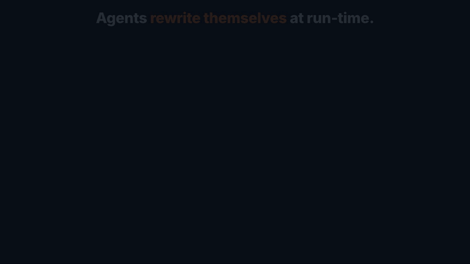
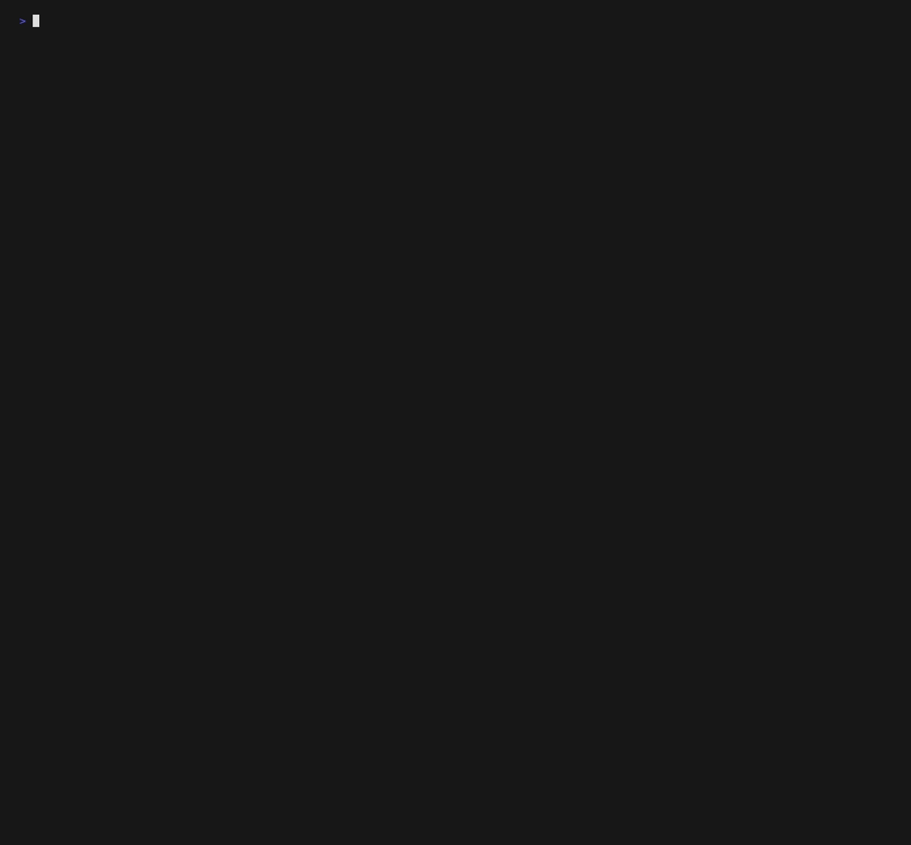
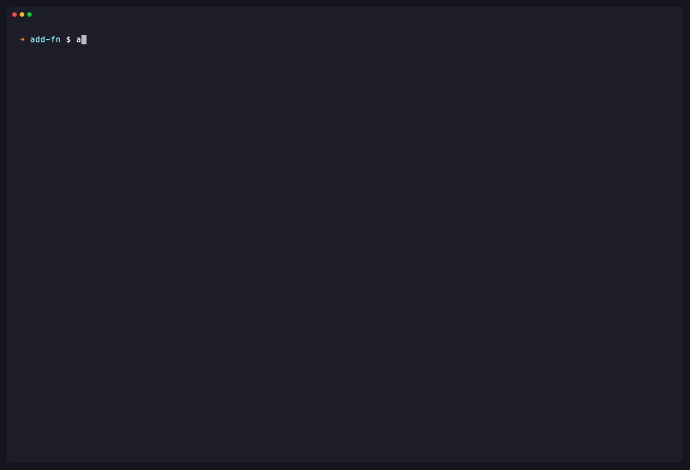
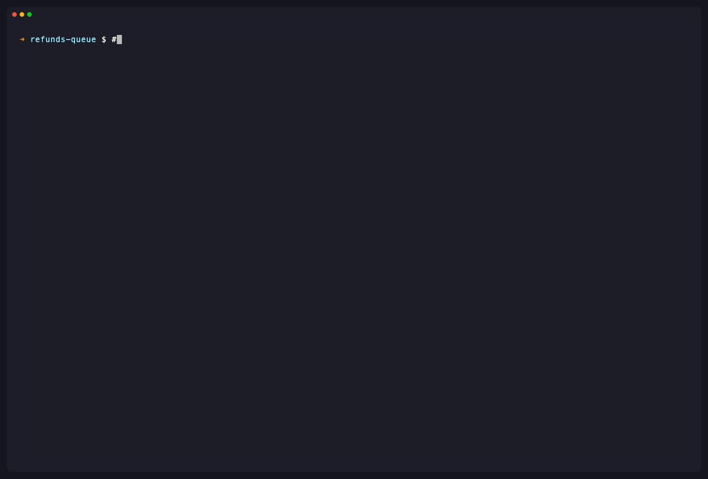

# agentvcs

[](https://github.com/EvolvingAgentsLabs/agentvcs/actions/workflows/ci.yml)
[](https://pypi.org/project/agentvcs/)
[](https://pypi.org/project/agentvcs/)
[](LICENSE)

**Version control for software that *evolves while it runs*.**

You build an agent system the modern way: **skills as markdown, tools as code,
prompts in files** — all under git. But an autonomous agent doesn't just *run* that
system; it **rewrites** it. In the field it writes a new skill, edits a tool, drops a
stale prompt, redirects its own goal — adapting to what it learns from real traffic.

**Git never sees any of it.** That run-time evolution lives only inside the running
process. The day your team cuts a new release from `main`, you **overwrite it**: the
hard-won field adaptations — and the reasoning traces that produced them — are gone.

That's the problem agentvcs solves. It is a multidimensional VCS that versions the
**run-time line** of your agent system — not just the files it changed (skills, tools,
prompts), but the **goal** it's pursuing, the **models** running it, and the
**intelligently-captured trace** that *caused* each change — and then **merges that
evolution back into your next release with an agent**, instead of letting a `git pull`
erase it.

```
 design-time line   ●──────●──────●  (what your team develops & releases under git)
                     \              \
                      \              ▼  agentvcs merge --reconcile <agent>
                       \            ◆  one reconciled history
                        \          ▲
 run-time line          ●────●────●  (what the autonomous system changed about itself)
   (captured by agentvcs: code+skills+tools+prompts · goal · models · selected traces)
```

The line between design-time and run-time has disappeared, so **two** lines now evolve
in parallel — what your team ships, and what the system changes about itself. Lose
either and you lose half the system. agentvcs versions **both** and reconciles them.

It does this by capturing every iteration as one commit across **four dimensions**
plus a **state**:

```
            ┌─────────── one commit ───────────┐
   code  →  │  tree     goal     models   trace │  state: fluid | crystallized
            └───────────────────────────────────┘
```

- **`fluid`** — still evolving: high-temperature models, code, skills, prompts and
  goals mutating between iterations. Powerful, expensive, non-deterministic.
- **`crystallized`** — a solution you trust, *frozen*. Models pinned to temperature 0
  and the message trace compiled into a replayable recipe. Cheap, stable,
  deterministic. `agentvcs freeze` does the conversion.

This is the open-source core — the "git for agents". Zero runtime dependencies,
pure Python stdlib, fully auditable. Apache-2.0.



*The core idea in 30 seconds: the run-time line (what the agent changed about itself)
and the design-time line (your next release) evolve in parallel — agentvcs versions
both and reconciles them with an agent, so a release never erases what the system
learned in the field.*

## Don't lose the evolution: reconcile the two lines (agent-driven merge)

When your team ships a new release, the autonomous system has already moved on — a
new skill here, an edited tool there, a redirected goal. A plain `git merge` would
either clobber those field adaptations or bury them in conflict markers, and it has
no idea what the *goal* or the *reasoning* should become. agentvcs merges
**multidimensionally**, and hands the semantic part to an agent:

```bash
# main    = your new release      (the design-time line, developed under version control)
# runtime = what agentvcs captured (the run-time line: skills/tools/prompts the system rewrote)
agentvcs checkout runtime
agentvcs merge main --reconcile "claude -p reconcile"   # any agent/command you trust
```

- **code · skills · tools · prompts** → a real **three-way merge** against the
  merge-base (line-level, with git-style conflict markers only on true overlaps). When
  one side has a higher **verified eval score** than the other, agentvcs resolves the
  *overlapping hunks* to that side automatically — **per-hunk**, before the agent is
  ever asked (configurable via `merge.autoselect_threshold`).
- **models** → the model pins are **unioned**.
- **goal · trace** → the *semantic* dimensions are **not** merged textually. agentvcs
  builds a reconciliation **bundle** (`base` / `ours` / `theirs`, each with its goal,
  reasoning trace, **eval/cost metrics**, and the full text of any unresolved
  **conflict**) and pipes it as JSON to your `--reconcile` agent. The agent returns
  the reconciled `{goal, trace, notes}` — and, optionally, **`resolved_files`**: the
  conflict-free code it synthesized, which agentvcs writes for you. So the **agent
  resolves the code too**, not just the reasoning.
- **swarm** → if either side reshaped its **sub-agent topology** (created, evolved or
  retired sub-agents at run-time), that topology is merged node-by-node too.

The result is a two-parent merge commit that keeps the field-learned behavior **and**
the new release — with an **agent**, not a textual heuristic, deciding how the goals
and the learnings combine. Add **`--target-goal "…"`** to *direct* the merge toward a
new objective (keeping only what serves it). Without `--reconcile`, agentvcs falls back
to a safe mechanical union so the merge still completes. The reasoning that *caused* the
runtime evolution is captured automatically (see [trace capture](#zero-friction-trace-capture-claude-code)),
so the merge is informed by *why* each side changed, not just *what* changed.

See it end-to-end on a [Vercel **eve**](https://vercel.com/eve) agent that rewrites
its own skill and spawns a sub-agent at run-time, while the team evolves the same
files in git — then merges into one (`bash examples/eve-evolve-merge/demo.sh`):



> This is the heart of the project. Everything below — the runtime frame, the trust
> gate (`freeze`/`recall`), and the optional Soul/corporate layers — exists to make
> that captured run-time line **measurable, trustworthy, and accountable**.



*The frame is **real**: `agentvcs runtime` reconstructs it from an actual captured
Claude Code session (the very session that built this tool — bundled as a
content-stripped fixture, so the `$17.13`, `17.6%` context, and tool counts are
its genuine numbers, not typed in). The `add()` below is a **worked example** of
the trust gate: `freeze` refuses the buggy version (`EVAL_FAILED`), and once the
eval passes it crystallizes a `verified` recipe that `recall` replays for ~$0.*

## The runtime your agent can't see

Because agentvcs already vacuums your session log, it can reconstruct the
**operational frame your closed runtime keeps to itself** — and put a number on
it. Run it against your *own* live session:

```bash
agentvcs runtime           # the whole frame, reconstructed from your session log
```

```
runtime frame  (what your runtime hides)
  turns:     11
  budget:    27208 tok  (in 24306 / out 2902)  $0.5822 / ceiling $2.0000
  context:   41293/200000 tok  (20.6%)  compactions=0
  model routing:
    claude-opus-4-8: 11 turns, 24306+2902 tok, $0.5822
  tools:     Read×3, Bash×2
```

The **dollar cost** of this session, how **full your context window** is, how many
times it was silently **compacted** (history dropped), which **models** actually
ran, your real **tool usage**, and any **subagent fan-out** — none of which your
runtime shows you. It's reconstructed from the log you already have, not estimated.

```bash
agentvcs budget            # token + dollar accounting vs a ceiling you set
agentvcs context           # context-window pressure + compaction count
agentvcs statusline        # one compact line for ~/.claude/settings.json statusLine
agentvcs watch             # live, redraws like top
```

Turn it on with `agentvcs init --runtime` (or `--claude-code`), and set a ceiling
and the window for your model in `agent.json`:

```json
"budget": { "ceiling_usd": 2.0, "windows": { "opus": 1000000 } }
```

> The window table defaults to 200k; if `context` reads **>100%** your model's real
> window just isn't in the table yet (e.g. Opus's 1M variant). Set it as above.

This is **cross-runtime**: the same frame reconstructs from a `qwen-code` session
(`agentvcs init --qwen-code`), so it isn't tied to Claude Code.

## Use it continuously in Claude Code

Wire it once and the frame is **always on** — agentvcs becomes your Claude Code
status line (every render) and versions your session (every turn), with no extra
work from you.



```bash
pipx install agentvcs          # or: pip install agentvcs  (a real binary on PATH)
cd your-project
agentvcs init --claude-code --runtime
```

Then add two lines to your Claude Code settings:

```jsonc
// ~/.claude/settings.json — live budget/$/context in your status bar, every render
"statusLine": { "type": "command", "command": "agentvcs statusline" }

// .claude/settings.json — auto-commit the frame each turn (a versioned session)
"hooks": { "Stop": [ { "hooks": [
  { "type": "command", "command": "agentvcs commit -m 'cc checkpoint'" }
] } ] }
```

Now every turn your status bar shows the live frame
(`⬡ goal · 260.3k tok $17.13/$50.00 · ctx 18%`), and `agentvcs log` is your
session as a history of frames — context pressure and cost over time, per turn.
`statusline` drains and ignores the session JSON Claude Code pipes it, so it can
never hang the bar. The numbers in the recording above are reconstructed from a
real captured session — see [`examples/recording/`](examples/recording/).

## Install

```bash
pip install agentvcs        # once published
# or from source:
pip install -e .
```

## Quickstart

```bash
agentvcs new my-agent               # scaffold a project already wired for agents (recommended)
# ...or initialize an existing directory:
agentvcs init                       # creates .agentvcs/ and a template agent.json
```

`agentvcs new` materializes a project a coding agent can drive immediately — an
`agent.json`, an `AGENTS.md` operating manual, the Claude Code skill, the MCP
config, and a first commit. Then just open it with your agent and describe what
to build.

> `avcs` is a built-in shorthand for `agentvcs` — every command below works with either name.

Declare the non-code dimensions in `agent.json`:

```json
{
  "goal": "Resolve refund requests autonomously",
  "models": [
    { "provider": "anthropic", "model": "claude-opus-4-8", "params": { "temperature": 1.0 } }
  ],
  "trace": "traces/run.jsonl",
  "state": "fluid"
}
```

The `trace` can be a file you maintain (above) **or** a *provider* that captures
the agent's native session automatically — see
[Zero-friction trace capture](#zero-friction-trace-capture-claude-code) below.

Then version the whole evolving system:

```bash
agentvcs commit -m "initial fluid refund agent"
agentvcs log                        # the evolution history, with goal + state per commit
agentvcs diff                       # dimensional diff: what changed in code vs goal vs models vs trace
agentvcs branch experiment          # a live branch — fork the execution, not just the text
agentvcs checkout experiment
agentvcs freeze                     # crystallize HEAD → deterministic recipe under crystal/
```

`agentvcs diff` is the point. It tells you *which dimension* moved:

```
705b2fb..1d4bd90
  code
    ~ app.py
  goal
    from: Resolve refund requests autonomously
    to:   Resolve refund requests with fraud checks
```

A goal redirect and a code change are now distinguishable events, not one opaque
text diff.

## Trust what you freeze: eval → freeze → recall

`fluid → crystallized` is only worth something if "frozen" means "proven". So
`freeze` is **gated by an eval**. Declare the check in `agent.json`:

```json
"eval": { "command": "python3 -c 'import app; assert app.add(2,2)==4'", "runs": 1 }
```

```bash
agentvcs eval              # run the check, record the score on this commit
agentvcs freeze            # crystallize — but ONLY if the eval passes
```

If the code is wrong, `freeze` refuses (`EVAL_FAILED`) instead of minting a
recipe you can't trust. Pass it, and the recipe is stamped `verified: true`. The
gate is honest under pressure: a flaky check (`"runs": 5`) must pass **all** runs,
and `freeze --force` past a failure marks the recipe `verified: false` — never a
silent lie. Secrets in the captured trace are `[REDACTED]` by default before they
ever hit the object store.

Then close the loop — *don't re-derive what you've already proven*:

```bash
agentvcs recall "implement an add function"   # have I solved this before?
#   45922c00d97d  score 0.33  ✓verified  implement a correct add(a,b)
#   -> replay the top hit:  agentvcs replay 45922c00d97d
agentvcs recall "..." --verified-only         # only recipes that passed their gate
agentvcs replay 45922c00d97d                  # re-run the frozen recipe for ~$0
```

A frozen, verified recipe is a cache hit: deterministic, cheap, and trustworthy
because it carries the proof that it worked.

## The Soul: identity, provenance & reputation (DeSoc) — opt-in

> **Optional layer.** Everything above is a pure multidimensional VCS with **zero
> crypto surface** — commits are unsigned, no keys exist. The Soul/DeSoc layer
> below is **off by default**; turn it on per repo with `agentvcs init --with-soul`
> (alias `--enable-crypto`). Skip this section if you just want versioning,
> rollback, and freeze.

A trace tells you *what happened*; it doesn't tell you *whose* competence it proves.
Copy an ordinary agent's files and you've copied the agent, reputation and all — it's
fungible. With the Soul layer on, agentvcs fixes that by giving each instance a
cryptographic **Soul**.

`agentvcs init --with-soul` births an **Ed25519 keypair**. The public key is the
agent's identity (its `soul_id`); the secret seed never leaves `.agentvcs/soul/`
(like an SSH key). Every `commit` is then **signed**, so the agent's history of
reasoning traces becomes a provenance chain *nobody can forge* without the seed —
yet *anyone can verify* with only the public id. (Without `--with-soul`, commits
are simply unsigned and `verify` reports them as such.)

```bash
agentvcs verify --all     # check the Ed25519 provenance of every commit (and SBTs)
#   valid    d85aafc653db  soul:dda8b170
#   valid    f635a1b24ca3  soul:dda8b170
#   PROVENANCE OK
```

Tamper with a signed commit's content and `verify` flags it `FORGED`. This realizes
*Decentralized Society: Finding Web3's Soul* (Weyl, Ohlhaver, Buterin): the instance
is the Soul, and its signed traces are the captured line of its life.

**Soulbound Tokens (SBTs).** A *verified* `freeze` is a proven accomplishment, so it
**mints a non-transferable credential** onto the Soul — *Verified Machine Experience*.

```bash
agentvcs soul            # the agent's CV: its identity + the SBTs it has earned
#   soul:dda8b170  (soul_id dda8b170…)
#   signed history: 2/2 commits
#   soulbound tokens: 1
#     ◆ implement, correct, react, frontend  score 1.0  (d85aafc653db)
```

Copy the files and you copy the *ledger* but not the secret seed: you can mint nothing
in its name, and its tokens still point at a Soul id you can't sign for. **Reputation
doesn't move with the bytes.** By default SBTs are self-attested (anchored to a
verifiable signed commit + a reproducible eval); an external oracle (e.g. SkillOpt —
see `examples/skillopt-soul/`) can issue them instead.

**Plural Intelligence.** Deploying 100 clones of your best agent is a *monoculture* —
they share a Soul, so they fail together. `agentvcs fleet` applies DeSoc's
**correlation discounting**: from a pool of Souls (described by their SBT skill
profiles) it selects the maximally *diverse* team, so a fixed budget covers the most
ground.

```bash
agentvcs fleet souls.json --size 3 --discount 1.0
#   selected 3 of 6 souls (diversity 1.000, discount 1.0)
#   ◆ soul:aaaa1111  ◆ soul:bbbb1111  ◆ soul:cccc1111   # react + security + backend
```

With `--discount 0` it just takes the strongest (and picks redundant clones); the
DeSoc default `1.0` rewards complementary, less-correlated experience.

> Read the full vision: [`docs/papers/souls-of-silicon.md`](docs/papers/souls-of-silicon.md).
> Zero new dependencies — the Ed25519 signer is a vendored, RFC 8032-verified pure-Python module.

## Commands

| command | what it does |
|---|---|
| `agentvcs new DIR` | scaffold a new agent project pre-wired with agentvcs |
| `agentvcs init` | create a repository |
| `agentvcs commit -m MSG` | snapshot code + goal + models + trace |
| `agentvcs log` | evolution history (state + goal per commit) |
| `agentvcs status` | working-tree changes, per dimension |
| `agentvcs show [COMMIT]` | one commit across all dimensions (`--trace` renders the conversation) |
| `agentvcs trace` | show the current trace source (file or auto-discovered session) |
| `agentvcs diff [A] [B]` | dimensional diff (default: parent..HEAD) |
| `agentvcs branch [NAME]` | list, or create a live branch |
| `agentvcs checkout REF` | restore the working tree from a branch/commit |
| `agentvcs merge BRANCH` | multidimensional merge; `--reconcile CMD` hands goal+trace+conflicts to an agent (which may return resolved code); `--target-goal` directs it; eval scores auto-resolve conflicts |
| `agentvcs rollback [REF]` | undo: restore the full prior state (the panic button) |
| `agentvcs eval [COMMIT]` | run `agent.json`'s eval and record the score |
| `agentvcs freeze [COMMIT]` | crystallize a fluid commit into a deterministic recipe (eval-gated) |
| `agentvcs replay [COMMIT]` | re-execute a crystallized recipe deterministically |
| `agentvcs recall GOAL` | rank frozen recipes matching a goal — replay instead of re-deriving |
| `agentvcs soul` | this instance's cryptographic identity and its earned SBTs (its CV) |
| `agentvcs verify [COMMIT]` | verify the Ed25519 provenance of commits (`--all` for the whole chain) |
| `agentvcs fleet PROFILES` | select a maximally-diverse fleet of souls (correlation discounting) |
| `agentvcs runtime` | the operational frame your runtime hides (budget/context/routing/tools/subagents) |
| `agentvcs budget` | token + dollar accounting vs a ceiling |
| `agentvcs context` | context-window pressure + compaction count |
| `agentvcs statusline` / `watch` | one compact status line / live `top`-style readout |
| `agentvcs ui` | serve a local web dashboard to *see* the evolution |

Add `--json` to any command for machine-readable output (see below). Use
`-C DIR` (like `git -C`) to run against a repo from any directory.

## See it: the local dashboard

The terminal shows you the history; `agentvcs ui` lets you *watch a mind move*.

```bash
agentvcs ui                 # opens http://127.0.0.1:8080 in your browser
```

A split view: the commit graph on the left, and for the selected commit, its
**dimensional diff** plus the agent's **inner monologue rendered as a chat** — the
exact `thinking` / `tool_use` / `tool_result` blocks that produced those lines of
code, with the goal and model that were in force. It polls, so as your agent keeps
committing in another terminal, new commits appear live.

Read-only, loopback-only, and (like the rest of agentvcs) **zero dependencies** —
just `http.server` and one self-contained HTML page. `--no-open` serves headless
and prints the URL; `--json` makes it machine-readable. The same data is available
as a small read-only JSON API under `/api/*` (see `docs/AGENT_MODE.md`).

## Built for agents (B2A)

The primary user of a VCS for agent fleets *is an agent*. agentvcs is designed so
a coding agent (Claude Code, Cursor, …) can drive it without guessing:

- **`--json` on every command** (or `AGENTVCS_JSON=1`) → one parseable object,
  no spinners, no color, no prose.
- **Stable `error.code`s** (`NOT_A_REPO`, `BAD_REF`, `ALREADY_CRYSTALLIZED`, …) →
  recover programmatically, not by parsing English. Full list in
  [`docs/AGENT_MODE.md`](docs/AGENT_MODE.md).
- **`agentvcs rollback`** → a real panic button: restores the *entire* prior state
  (code + goal + models + trace) and is itself reversible.
- **Auto-discovery** → `agentvcs init` scaffolds an `AGENTS.md` so the next agent
  to open the repo learns the workflow on its own.
- **A Claude Code skill** ships in [`.claude/skills/agentvcs/`](.claude/skills/agentvcs/SKILL.md).
- **An MCP server** (zero-dependency, stdio JSON-RPC):

  ```bash
  claude mcp add agentvcs -- agentvcs-mcp
  ```

  Exposes `avcs_log`, `avcs_show`, `avcs_diff`, `avcs_status`, `avcs_commit`,
  `avcs_freeze`, `avcs_replay`, `avcs_rollback`, `avcs_branch`, `avcs_checkout`,
  `avcs_trace`.

### Zero-friction trace capture (Claude Code)

Asking an agent to write its own trace file is fragile — it costs tokens and the
agent can simply forget. Instead, let agentvcs **vacuum the agent's native session
log** at commit time. Wire it once:

```bash
agentvcs init --claude-code     # or: agentvcs new my-agent --claude-code
```

which sets, in `agent.json`:

```json
"trace": { "provider": "claude-code", "auto": true },
"models": [{ "provider": "anthropic", "auto": true }]
```

Now you maintain **no** trace file. Each `agentvcs commit` reads Claude Code's
own session transcript — the real `tool_use` / `tool_result` / `thinking` blocks,
not a summary — and the model pin is detected from the model that actually ran.

```bash
agentvcs trace                  # confirm which session is hooked (+ message count, model)
agentvcs commit -m "v1"         # captures the live conversation, zero extra work
agentvcs show --trace           # the commit + the exact conversation that produced it
agentvcs freeze                 # crystallize that real, high-fidelity trace
```


*`commit` pulls the conversation straight from your live session — the actual
`thinking` / `tool_use` / `tool_result` — and `show --trace` puts it next to the
code. You never write a trace file.*

Known secrets are scrubbed by default (`redact` / `redact_defaults` to tune). The
`trace` dimension is **pluggable** — `claude-code`, `qwen-code`, `vercel-eve` and
`anthropic-managed` ship today (`agentvcs init --qwen-code` / `--eve` /
`--anthropic-managed` wire the others), and any tool that records a session (e.g. one
backed by SQLite) can add another without changing the on-disk format. The Vercel
**eve** integration adds Time-Travel Debugging to filesystem-first agents (`npx
@agentvcs/eve init` drops the hook — see [`packages/eve/`](packages/eve/) and
[`examples/eve/`](examples/eve/)); the `anthropic-managed` provider versions agents
that run server-side in Anthropic's [managed cloud](https://platform.claude.com/docs/en/managed-agents/overview).
The same trace and the same runtime frame reconstruct identically across providers,
so nothing here is tied to one runtime. See [`docs/SPEC.md`](docs/SPEC.md).

**New here?** Walk through it end-to-end in
[`docs/TUTORIAL.md`](docs/TUTORIAL.md) — build a tiny bot with Claude Code and
version every iteration, from first commit to a frozen recipe.

```jsonc
$ agentvcs diff --json
{"ok": true, "command": "diff", "a": "705b2fb…", "b": "1d4bd90…",
 "diff": {"code": {"added": [], "removed": [], "modified": ["app.py"]},
          "goal": {"from": "…autonomously", "to": "…with fraud checks"},
          "models": null, "trace": null, "state": null}}
```

## How it stores things

Content-addressed objects under `.agentvcs/objects/`, exactly like git's loose
objects — but the object types are `commit`, `tree`, `goal`, `modelpin`, `trace`
and `crystal`. Identical dimensions are stored once. See
[`docs/SPEC.md`](docs/SPEC.md) for the on-disk format — that spec *is* the
standard we're proposing.

## Try the examples

A minimal first commit:

```bash
cd examples/refund-agent
agentvcs init
agentvcs commit -m "first run"
agentvcs show
```

Or run the **full agent loop** — a simulated agent that iterates, makes a
mistake, rolls it back, and freezes the result, driving agentvcs entirely in
`--json` mode:

```bash
bash examples/agent-loop-demo/run.sh
```

See [`examples/agent-loop-demo/`](examples/agent-loop-demo/) for the walkthrough,
or [`examples/recording/`](examples/recording/) for a ready-to-share screencast of
it. To put a **real** agent in front of agentvcs and score whether it adopts the
loop, use [`examples/claude-code-task/`](examples/claude-code-task/). To see the
**zero-friction trace provider** (commit captures the live Claude Code session,
no trace file), see [`examples/claude-code-trace/`](examples/claude-code-trace/).
To version a **filesystem-first [Vercel eve](https://eve.dev) agent** and undo a
hallucinated turn with `rollback`+resume, see [`examples/eve/`](examples/eve/)
(`bash examples/eve/demo.sh` — runs offline). Every example is indexed in
[`examples/README.md`](examples/README.md).

## Scope

This repo is the **local protocol and runtime**, and it is deliberately
complete on its own — it works offline, on your machine, forever. It already
includes the multidimensional, **agent-driven merge** (`merge --reconcile`) that
reconciles the run-time and design-time lines, and a local **visual evolution tree**
(`agentvcs ui`). Hosted collaboration and fleet observability at scale are a separate
concern and not part of this open-source core.

## License

Apache-2.0. See [LICENSE](LICENSE).
